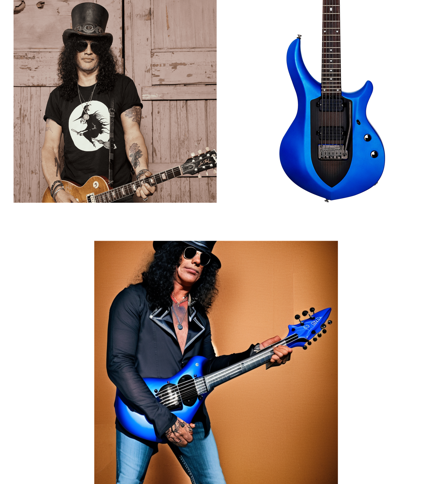

# Mult-Subject Personalization in Text-to-Image Diffusion Model

<div class="image">
<p align="center">

</p>
</div>

## Fine-tuning with new subject
Take few images of the subject to be personalized and locate them in `data/{SUBJECT_NAME}` directory. Also, you need to choose the {BASE_CATEGORY} this subject will be trained from.

Then, run the following command:
```
export MODEL_NAME="stabilityai/stable-diffusion-2-1"
export INSTANCE_DIR="./data/{SUBJECT_NAME}"
export OUTPUT_DIR="./output/{SUBJECT_NAME}"

accelerate launch finetuning.py \
  --pretrained_model_name_or_path=$MODEL_NAME  \
  --instance_data_dir=$INSTANCE_DIR \
  --instance_prompt="{BASE_CATEGORY}" \
  --token_num=1 \
  --output_dir=$OUTPUT_DIR \
  --resolution=768 \
  --train_batch_size=1 \
  --max_train_steps=4000
```
At the end of the fine-tuning process, the embedding of the subject will be located as `residual.pt` in the `/output/{SUBJECT_NAME}` directory.

## Generating personalized images
Create a configuration file as the follwing:
```
[
    {
        "prompt":"a photo of {SUBJECT_NAME}", 
        "residual_dict": {
            "person":"embeddings/petrucci.pt",
            "guitar":"embeddings/majesty.pt",
            "shoes":"embeddings/airforce.pt",
            "anime":"embeddings/goku.pt",
            "man":"embeddings/slash.pt"
        },
        "color_context":{
            "255,0,0":["{SUBJECT_NAME}",2.5]
        },
        "guidance_steps":0,
        "guidance_weight":0.08,
        "weight_negative":-1e8,
        "layout":"layouts/two_people.png",
        "subject_list":[["{SUBJECT_NAME}",4]]
    }
]
```
``prompt`` is the prompt using the residual_dict subject names.
``residual_dict`` is a dictionary of the subjects embedding paths. ``color_context`` is a dictionary of RGB color to the subject name and the weight of the subject (how much focus we want to assign this subject). ``guidance_steps`` is how much steps of the positioning guidance we want to perform (in case of single-subject personalization it should be 0). ``guidance_weight`` and ``weight_negative`` are the weight that we want to assign for the guidance process in the region features for the relevant subject and how much weakening we want to apply for this subject in irrelevant regions. ``layout`` is the path to the layout image with the color boxes of the subjects positions. ``subject_list`` is a list containing pairs of the the {SUBJECT_NAME} and the index (starting from 1) of the subject word in the prompt.

After configuring your file, run the following command:

```
export MODEL_NAME="stabilityai/stable-diffusion-2-1"
export CONFIG_DIR="./configs/guidance_conf_single.json"

python generate_images.py --pretrained_model_name MODEL_NAME --generation_config CONFIG_DIR

```
The images will be generated to the ``results`` directory and will be located in a directories named by the personalized subjects and the prompt.

## Generation Example
Below is a configuration file for generating multiple personalized subjects.

```
[
    {
        "prompt":"a photo of person and guitar on the beach",
        "residual_dict": {
            "person":"embeddings/petrucci.pt",
            "guitar":"embeddings/majesty.pt"
        },
        "color_context":{
            "255,0,0":["person",2.5],
            "0,0,255":["guitar",2.5]
        },
        "guidance_steps":50,
        "guidance_weight":0.08,
        "weight_negative":-1e8,
        "layout":"layouts/guitar.png",
        "subject_list":[["person",4],["guitar",6]]
    }
]
```

The results will be located in `results/guitar_person/a_photo_of_person_and_guitar_on_the_beach`.


